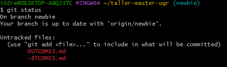
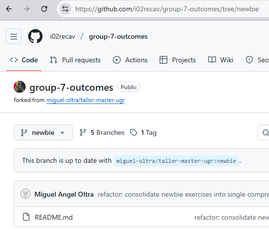

# Exercise Outcomes Submission Template

**Student/Group Name**: Group 7
**Level Completed**: newbie 
**Date**: 03/01/2026

---

## 📋 Exercise Summary

### Exercise: [Exercise Title]
**Status**: ✅ Completed 

**What I did**:
Despues de instalar git en el sistema, hemos creado un usuario local y creado la key SSH para autenticar con GitHub y hemos configurado el servicio. Posteriormente, hemos clonado un repositorio remoto.
En el respositorio clonado local hemos creado un fichero nuevo, le hemos hecho un commit y hemos visto desde el log que se ha realizado. Despues hemos trabajado con ramas locales del mismo modo y hemos intentado hacer un push pero no teniamos permisos


**Commands Used**:
git config --global user.name "i02recav"
git config --global user.email "i02recav@msn.com"
ssh-keygen -t ed25519 -C "i02recav@msn.com"
git clone git@github.com:miguel-oltra/taller-master-ugr.git
git status
vi hello.txt
git add hello.txt -f
git commit -m "Add hello.txt with my name"
git log
git branch feature/my-info
git checkout feature/my-info
vi my-info.txt
git add my-info.txt -f
git commit -m "Add personal information"
git push origin feature/my-info
git checkout newbie
git pull origin newbie

**Results/Output**:
```
# Salidas relevantes de los comandos ejecutados
git log
    commit 35382fabe4fa4b6c9441e79b03888e1a2b911525 (HEAD -> main)
    Author: i02recav <i02recav@msn.com>
    Date:   Fri Jan 2 17:41:01 2026 +0100

        Add hello.txt with my name

git push origin feature/my-info
    Enter passphrase for key '/c/Users/i02re/.ssh/id_ed25519':
    ERROR: Permission to miguel-oltra/taller-master-ugr.git denied to i02recav.
    fatal: Could not read from remote repository.

    Please make sure you have the correct access rights
    and the repository exists.

git pull origin newbie
    Enter passphrase for key '/c/Users/i02re/.ssh/id_ed25519':
    From github.com:miguel-oltra/taller-master-ugr
     * branch            newbie     -> FETCH_HEAD
    Already up to date.

git branch -a
	feature/my-info
      group-7-outcomes/newbie
      main
    * newbie
      remotes/origin/HEAD -> origin/main
      remotes/origin/intermediate
      remotes/origin/main
      remotes/origin/master
      remotes/origin/master-of-the-universe
      remotes/origin/newbie

git log --oneline --graph --all
    * a85d5aa (feature/my-info) Add personal information
    * 35382fa (main) Add hello.txt with my name
    * 9602351 (origin/main, origin/HEAD) Adding GenAI guidelines
    * 7ad3af4 docs: update main branch files to reflect consolidated exercise structure (1 per level)
    * 4d9131e chore: remove instructor files from repository tracking
    *   adbb307 Merge pull request #9 from miguel-oltra/patch-gitignore-update
    |\
    | * e4709e6 Updated CODEOWNERS file
    | * 2a39a02 chore: add INSTRUCTOR_GUIDE.md to gitignore
    | * 0abdbae chore: add SUMMARY.md to gitignore for instructor files
    |/
    * 88a54ab chore: Add .gitignore to exclude instructor files and sensitive data
    * e39ff08 PROMPT for updated
    * df1cfdd fix: Update CODEOWNERS to allow trainee work while protecting exercise branches
    * a011fad config: Add CODEOWNERS file for code review requirements
    * 769be64 docs: Add complete implementation summary
    * 9d008fa Updated README.MD with guidelines for the exercises
    * f66bf22 docs: Update MODEL_SPEC.MD with PROMPT 2 requirements
    * c24fd57 docs: Add outcome submission process and evaluation criteria
    * ec488d0 Update main README with complete training overview and navigation
    | * b0fb9dc (origin/master-of-the-universe) refactor: consolidate master-of-the-universe exercises into single comprehensive exercise
    | * d1ef79f docs: Add submission instructions to master-of-the-universe level
    | * 5bffa64 Update README for master-of-the-universe level exercises
    |/
    | * b5d8eb6 (origin/master) refactor: consolidate master exercises into single comprehensive exercise on history rewriting
    | * 960a0a6 docs: Add submission instructions to master level
    | * f0055a0 Update README for master level exercises
    |/
    | * 994450b (origin/intermediate) refactor: consolidate intermediate exercises into single comprehensive exercise
    | * a1c17e7 docs: Add submission instructions to intermediate level
    | * 9f25f7a Update README for intermediate level exercises
    |/
    | * 360f4a4 (HEAD -> newbie, origin/newbie, group-7-outcomes/newbie) refactor: consolidate newbie exercises into single comprehensive exercise
    | * 5eedc97 docs: Add submission instructions to newbie level
    | * 45e1c31 Update README for newbie level exercises
    |/
    * dc58203 Revert "Update README.md"
    * e2db1ca (tag: v0.0.1) Update README.md
    * 3d651c3 Update README.md
    * 4cc5635 Initial commit


```

**Screenshots** (if applicable):
- 
- 


---

## 🎯 Key Learnings

**Main concepts I learned**:
1. [Concept 1, "Creacion de usuario local"]
2. [Concept 2, "Configuración de SSH en local y GITHUB"]
3. [Concept 3, "Commit, log y creación de ramas"]
4. [Concept 4, "Push fallido por  permisos"]
5. [Concept 5, "Clonación de repositorios remotos"]

**Skills I improved**:
- [Skill 1, "Using SSH keys for authentication"]
- [Skill 2, "Crear y manejar ramas en git"]
- [Skill 3, "Realizar commits y ver el historial con log"]
- [Skill 4, "Manejo de errores al hacer push"]
- [Skill 5, "Configuración inicial de git"]
- [Skill 6, "Clonar repositorios remotos"]
- [Skill 7, "Agregar archivos al staging area"]
- [Skill 8, "Navegación entre ramas con checkout"]
- 

---

## 🚧 Challenges Faced

### Challenge 1: [SSH]
**Problem**: Configuración de la clave SSH para autenticar con GitHub

**Solution**: Genar la clave SSH con ssh-keygen y añadir la clave pública que se encontraba en el fichero pub generado en GitHub 

**Commands/Approach**:
ssh-keygen -t ed25519 -C "i02recav@msn.com"
En github en el boton <>code aparecia una advertencia de que no habia clave SSH configurada, y al darle click te llevaba a la pantalla para añadir la clave pública generada

---

### Challenge 2: [Staging vs commit]
**Problem**: ¿alguna confusión entre staging area y commit?

**Solution**: Entendemos que el staging area es una zona temporal donde se preparan los cambios antes de hacer commit, y el commit es el acto de guardar esos cambios en el historial del repositorio.

## Challenge 3: [Push/Pull]
**Problem**: ¿Problemas con Push y Pull?

**Solution**: Al hacer push, recibimos un error de permisos porque no teniamos acceso de escritura al repositorio remoto. Para solucionarlo, necesitariamos solicitar acceso al propietario del repositorio o trabajar en un fork del mismo. El pull se realizó correctamente ya que teniamos permisos de lectura.

---

## 💭 Personal Reflection

**¿Que he aprendido sobre las 3 arquitectura de arbol (working dir, staging y repo)**:
Que el working dir es donde trabajamos con los archivos, el staging area es una zona temporal donde preparamos los cambios antes de hacer commit, y el repositorio es donde se guarda el historial de cambios.

**¿Cuando utilizaría ramas en proyectos reales?**:
Utilizaría ramas para desarrollar nuevas características, corregir errores o experimentar con ideas sin afectar la rama principal del proyecto.

**¿Cual es la diferencia entre repositorio local y remoto?**:
La diferencia es que el repositorio local está en nuestro equipo y es donde trabajamos directamente, mientras que el repositorio remoto está alojado en un servidor (como GitHub) y permite la colaboración con otros desarrolladores.

---

## 📊 Self-Assessment

Rate your confidence level for each topic (1-5, where 5 is very confident):

| Topic | Confidence (1-5) | Notes |
|-------|------------------|-------|
| Basic Git commands | [5 ] | |
| Branching & merging | [4 ] | |
| Remote operations | [4 ] | |
| Conflict resolution | [4 ] | |
| History rewriting | [ 4] | |
| Git hooks | [3 ] | |
| Security practices | [2 ] | |

---

## 🔗 Evidence/Artifacts

**Links to branches/commits**:
- Link to your outcome branch: `https://github.com/i02recav/group-7-outcomes/tree/newbie`
- Key commits demonstrating your work:
  - Commit hash: [Short description]
  - Commit hash: [Short description]

**Additional files created** (if any):
- File 1: [Description]
- File 2: [Description]

---

## ✅ Completion Checklist

Before submitting, ensure you have:
- [X] Completed the exercise for your chosen level (including all parts)
- [X] Documented all commands used with their outputs
- [X] Described challenges and how you resolved them
- [X] Provided a thoughtful reflection on your learning
- [X] Self-assessed your confidence in each topic
- [X] Pushed your outcome branch to the remote repository
- [ ] Created a Pull Request (if required by your instructor)

---

## 📝 Additional Comments

[Any additional thoughts, questions, or feedback about the exercises]

---

**Submission Date**: [3/1/2025]  
**Ready for Review**: ✅ Yes 
